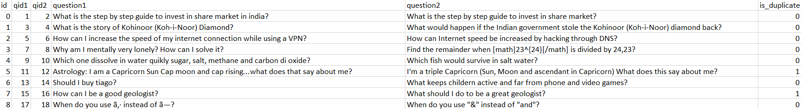

# BertFineTuning

## Project Overview
This project aims to fine-tune a pre-trained <a href="https://arxiv.org/pdf/1810.04805.pdf">BERT</a> (Bidirectional Encoder Representations from Transformers) model on a duplicate/similarity detection task using Quora Question Pairs dataset for training. 

The Quora Question Pairs (QQP) dataset has been the subject of a <a href="https://www.kaggle.com/c/quora-question-pairs">Kaggle competetion </a> in 2017 and a wealth of information pertaining to this dataset is publicly available (see <a href="https://www.kaggle.com/c/quora-question-pairs/notebooks">Kaggle</a>) . The dataset consists of question pairs extracted from Quora.com and made available by the same company(see <a href="https://www.quora.com/q/quoradata/First-Quora-Dataset-Release-Question-Pairs">QQP</a>).

## Problem Statement

As <a href="https://www.quora.com/q/quoradata/First-Quora-Dataset-Release-Question-Pairs">described</a> by Quora, the inefficiencies of categorizing questions in Quora's question databse can hinder efforts to allocate a single page to questions that are logically related. As a result, a better model compared to Random Forest model ,which was being used by Quora for this task, is required to detect semantically equivalent sequences.

</img>

## Metrics
Considering the fact that the QQP dataset is imbalance the metrics selected for fine-tuning the model are MCC, ACC, F1 and Recall. Furthermore, confusion matrix has been utilized to better understand the results. While the above mentioned metrics have been utilized for this tasks, other metrics have also been collected using the <a href="https://github.com/sepandhaghighi/pycm">pycm</a> package and are available as one of the variables collected when the fine-tuning is performed.

# Analysis

## Data Exploration

