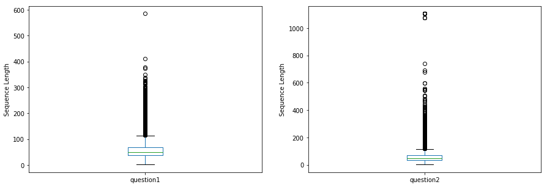
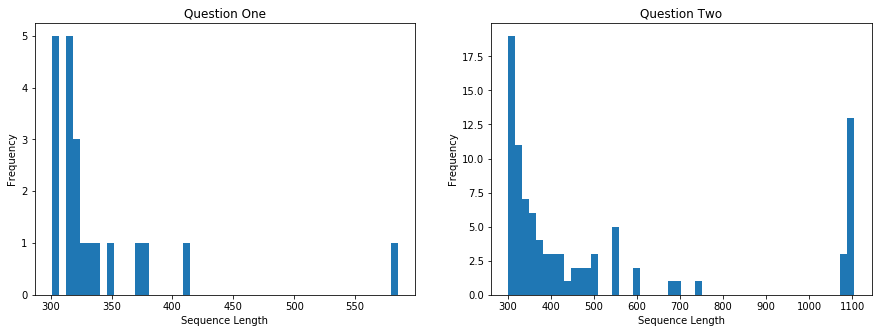

# BertFineTuning

## Project Overview
This project aims to fine-tune a pre-trained <a href="https://arxiv.org/pdf/1810.04805.pdf">BERT</a> (Bidirectional Encoder Representations from Transformers) model on a duplicate/similarity detection task using Quora Question Pairs dataset for training. 

The Quora Question Pairs (QQP) dataset has been the subject of a <a href="https://www.kaggle.com/c/quora-question-pairs">Kaggle competetion </a> in 2017 and a wealth of information pertaining to this dataset is publicly available (see <a href="https://www.kaggle.com/c/quora-question-pairs/notebooks">Kaggle</a>) . The dataset consists of question pairs extracted from Quora.com and made available by the same company(see <a href="https://www.quora.com/q/quoradata/First-Quora-Dataset-Release-Question-Pairs">QQP</a>).

## Problem Statement

As <a href="https://www.quora.com/q/quoradata/First-Quora-Dataset-Release-Question-Pairs">described</a> by Quora, the inefficiencies of categorizing questions in Quora's question databse can hinder efforts to allocate a single page to questions that are logically related. As a result, a better model compared to Random Forest model ,which was being used by Quora for this task, is required to detect semantically equivalent sequences.

</img>

## Metrics
Considering the fact that the QQP dataset is imbalance the metrics selected for fine-tuning the model are MCC, ACC, F1 and Recall. Furthermore, confusion matrix has been utilized to better understand the results. While the above mentioned metrics have been utilized for this tasks, other metrics have also been collected using the <a href="https://github.com/sepandhaghighi/pycm">pycm</a> package and are available as one of the variables saved during checkpoint creation.

# Analysis

## Data Exploration

The dataset is imbalanced and the number of question pairs that are duplicates are much lower than the ones that are unique. The below figure demonstrates the imbalance observed in the dataset.

</img>

In case of both duplicate and unique question pairs the histograms show a positive skew (skewed right).

</img>

 For both categories outliers are detected having sequence lengths above 200 characters.

</img>

Sequqnces in question two are observed to show a higher number of outliers. 

</img>

As demonstrated in the following figure, the majority of sequences have five words in common.

</img>

Histograms of duplicated and unique records show a positive skew. While the distributions are similar the duplicated records show a higher number of instances that have zero to five words in common.

</img>

# Methodology

## Data Preprocessing

- Conversion to lower case.
- word2vec was used to detect out of vocabulary words. 
- For all out of vocabulary words punctuation was removed.
- All tokens were then lemmatized.
- Next all stop words were removed.
- Finally all remaining punctuations were removed

## Train, Validation and Test splits
The cleaned data was then split into three portions with fractions: 0.6,0.2 and 0.2 using calculated class weights.
</img>

## Data formatting for BERT
At the final stage of processing, the the data is properly formatted for BERT. (please see following table for examples)

</img>

# Implementation
The <a href="https://github.com/huggingface/pytorch-transformers">Hugging Face</a> implementation of BERT model has been utilized as the base for creating the model, to this a simple classifier is added (feed forward with batchnorm and no dropout) as the ouput layer. For the purpose of training the model, two seperate learning rates have been chosen for the pre-trained model and the classifier. This method allows minor changes in the pre-trrained weights while the change in the classifier are more prominent. It is also possible to first train the classifier and freeze the pretrained BERT, here this method has not been utilized for the sake of simplicity. 

# Model Evaluation and Validation

Accuracy and F1 for training and validation splits: 

</img>

# Justification
As can be seen from the above results at epoch two the model shows the best results, upon training the model further an increase in test loss is observed. Based on these results an early stopping strategy should be used to stop the model from overfitting the training data.

# Relection
This project demonstrates the use of fine-tuning to reach SOTA results using BERT model. The application of transfer learning in NLP is very exciting. 

# Improvment
The results can be further improved by optimizing hyper parameters especially batch size, learning rate and weight decay. 

